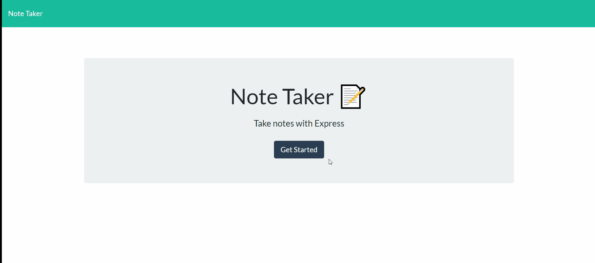

# Unit 11 Express: Note Taker
----------------------------------------------------------------
###  Description: Allows users to write, save, and delete notes.
----------------------------------------------------------------
#Demo: 
-------------------------------------------------------------
#Table of Contents
----------------------------------------------------------------
 *Installation: npm i

 *Usage:The Note Taker application can be utilized to write and save notes as well as delete them. It uses express on the backend to store notes in string format. The app can also retrieve notes and displays them to the user in JSON format for enhanced readability. 

 *License: None

 *Test: node server.js or nodemon
 ---------------------------------------------------------
 
Which functions does the Note Taker have?

* GET `/notes` - Should return the `notes.html` file.

  * GET `*` - Should return the `index.html` file

* The application has a `db.json` file on the backend that will be used to store and retrieve notes using the `fs` module.

* The following API routes have been built:

  * GET `/api/notes` - Should read the `db.json` file and return all saved notes as JSON.

  * POST `/api/notes` - Should receive a new note to save on the request body, add it to the `db.json` file, and then return the new note to the client.

  * DELETE `/api/notes/:id` - Should receive a query parameter containing the id of a note to delete. This means that each note has a unique `id` when it's saved. In order to delete a note, the app reads all notes from the `db.json` file, removes the note with the given `id` property, and then rewrites the notes to the `db.json` file.
---------------------------------------------------------
#Made by LanChi Pham, &copy;Copyright 2020
----------------------------------------------------------
  